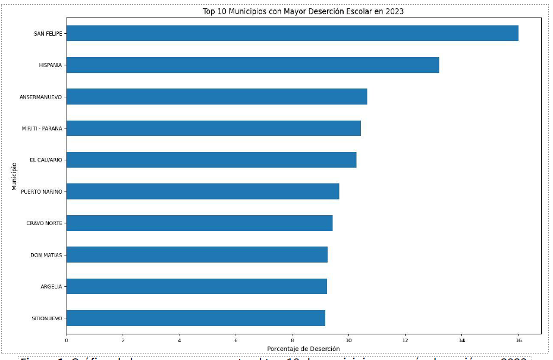

# IP - 2025-10
# N4-PROY: Educación en Colombia

## Objetivo general
Practicar los conceptos clave estudiados en el Nivel 4 del curso

### Objetivos específicos 
1.	Implementar algoritmos para construir y recorrer matrices.
2.	Usar las librerías Pandas y matplotlib para la construcción de reportes gráficos.
3.	Practicar la técnica “Dividir y Conquistar”.

### Actividad 1 | Entender el problema 
En Colombia, la educación desempeña un papel crucial en el desarrollo social y económico del país. En este proyecto, usted analizará algunos indicadores educativos a partir de un conjunto de datos publicado por el Ministerio de Educación Nacional denominado: [Estadísticas de educación preescolar, básica y media por municipio](https://www.datos.gov.co/Educaci-n/MEN_ESTADISTICAS_EN_EDUCACION_EN_PREESCOLAR-B-SICA/nudc-7mev/about_data). Se provee una versión simplificada de estos datos (por ejemplo, sin registros incompletos o nulos), para crear una aplicación capaz de elaborar reportes básicos. 

### Actividad 2 | Preparar el ambiente de trabajo 
1.	Cree una carpeta para trabajar poniéndole su nombre o login.
2.	Descargue de Bloque Neón el archivo con el “esqueleto” del proyecto (n4-esqueleto.zip) y descomprímalo en su carpeta de trabajo. Este esqueleto incluye cinco archivos: educacion.py, consola_educacion.py, educacion.csv, coordenadas.txt y mapa.png.
3.	Abra Spyder y cambie la carpeta de trabajo para que sea la carpeta con el esqueleto.

### Actividad 3 | Construir el módulo de la lógica 
4. En Spyder, diríjase a su carpeta de trabajo y edite el archivo "educacion.py", el cual contendrá la lógica de la aplicación. Deberá crear funciones, **debidamente documentadas**, que cumplan los requerimientos descritos a continuación. **Use composición para que las funciones llamen a otras cuando sea necesario y evite así la duplicación de código.** Puede usar funciones auxiliares. **Al recorrer diccionarios o listas, elija entre un recorrido total o parcial según se requiera.** Su aplicación debe satisfacer los siguientes requerimientos.

==Nota importante:== **1) Usted debe cumplir todas las [buenas prácticas del curso](https://eerosales24.github.io/iph_2025_10/general/buenas_practicas/#/). 2) Lo anterior incluye que usted debe crear como mínimo un doctest por cada función en la lógica** que no produzca gráficos (es decir, se exceptúa a los requerimientos 2, 3 y 8). 

#### Requerimiento 1 – Carga de datos
Se requiere que cargue un archivo CSV con la información del dataset y la organice en un DataFrame usando Pandas. Cree una función que reciba el nombre del archivo como único parámetro (str), cargue los datos en el DataFrame y lo retorne. El archivo a cargar se denomina educacion.csv y contiene las columnas explicadas en la Tabla 1: 

| Nombre de la columna | Descripción                                                                      | Tipo  | Ejemplo      |
| -------------------- | -------------------------------------------------------------------------------- | ----- | ------------ |
| `ANIO`               | Año de referencia de los datos. **Los datos cubren el rango entre 2011 y 2023.** | `int` | `2023`       |
| `MUNICIPIO`          | Nombre del municipio.                                                            | `str` | `"Medellin"` |
			 **Tabla 1.** Descripción de las columnas del archivo: educacion.csv. 
