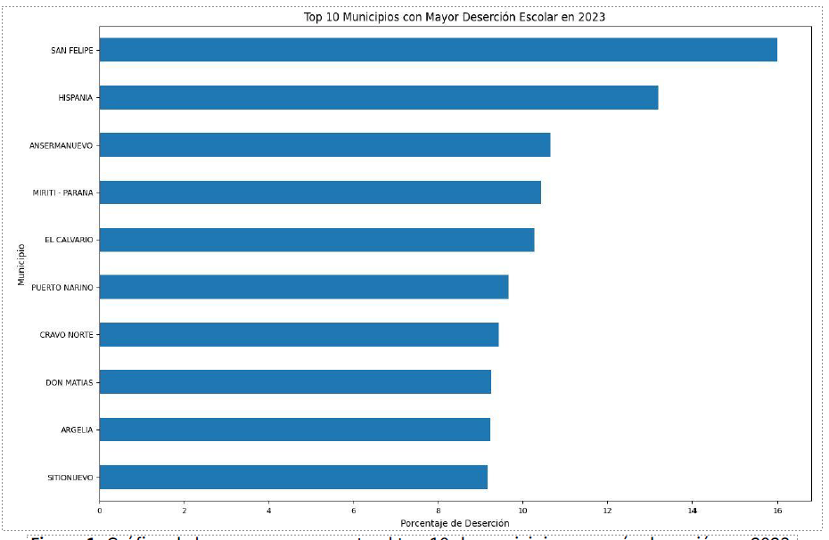

# IP - 2025-10
# N4-PROY: Educación en Colombia

> [!NOTE]- Note Title 
> 
>**MUY IMPORTANTE:** Este proyecto debe desarrollarse de forma individual y el entregable debe ser 100% de su autoría. No está permitido utilizar ayudas no autorizadas (incluyendo chatbots o tecnologías similares), ni emplear temas o sintaxis que no hayan sido estudiados en el curso. El incumplimiento de lo anterior resultará en una calificación de cero (0.0) para todo el Nivel 4 y puede resultar en un proceso disciplinario.

## Objetivo general
Practicar los conceptos clave estudiados en el Nivel 4 del curso

### Objetivos específicos 
1.	Implementar algoritmos para construir y recorrer matrices.
2.	Usar las librerías Pandas y matplotlib para la construcción de reportes gráficos.
3.	Practicar la técnica “Dividir y Conquistar”.

### Actividad 1 | Entender el problema 
En Colombia, la educación desempeña un papel crucial en el desarrollo social y económico del país. En este proyecto, usted analizará algunos indicadores educativos a partir de un conjunto de datos publicado por el Ministerio de Educación Nacional denominado: [Estadísticas de educación preescolar, básica y media por municipio](https://www.datos.gov.co/Educaci-n/MEN_ESTADISTICAS_EN_EDUCACION_EN_PREESCOLAR-B-SICA/nudc-7mev/about_data). Se provee una versión simplificada de estos datos (por ejemplo, sin registros incompletos o nulos), para crear una aplicación capaz de elaborar reportes básicos. 

### Actividad 2 | Preparar el ambiente de trabajo 
1.	Cree una carpeta para trabajar poniéndole su nombre o login.
2.	Descargue de Bloque Neón el archivo con el “esqueleto” del proyecto (n4-esqueleto.zip) y descomprímalo en su carpeta de trabajo. Este esqueleto incluye cinco archivos: educacion.py, consola_educacion.py, educacion.csv, coordenadas.txt y mapa.png.
3.	Abra Spyder y cambie la carpeta de trabajo para que sea la carpeta con el esqueleto.

### Actividad 3 | Construir el módulo de la lógica 
4. En Spyder, diríjase a su carpeta de trabajo y edite el archivo "educacion.py", el cual contendrá la lógica de la aplicación. Deberá crear funciones, **debidamente documentadas**, que cumplan los requerimientos descritos a continuación. **Use composición para que las funciones llamen a otras cuando sea necesario y evite así la duplicación de código.** Puede usar funciones auxiliares. **Al recorrer diccionarios o listas, elija entre un recorrido total o parcial según se requiera.** Su aplicación debe satisfacer los siguientes requerimientos.

==Nota importante:== **1) Usted debe cumplir todas las [buenas prácticas del curso](https://eerosales24.github.io/iph_2025_10/general/buenas_practicas/#/). 2) Lo anterior incluye que usted debe crear como mínimo un doctest por cada función en la lógica** que no produzca gráficos (es decir, se exceptúa a los requerimientos 2, 3 y 8). 

**Bono:** Si crea al menos 3 doctests por cada función (no gráfica) y **todos** son correctos, documentados, significativos, no redundantes y **basados completamente en temas estudiados en el curso**, obtendrá un bono de **0.25**, aplicables **solo** a la nota final de este proyecto.

#### Requerimiento 1 – Carga de datos
Se requiere que cargue un archivo CSV con la información del dataset y la organice en un DataFrame usando Pandas. Cree una función que reciba el nombre del archivo como único parámetro (`str`), cargue los datos en el *DataFrame* y lo retorne. El archivo a cargar se denomina `educacion.csv` y contiene las columnas explicadas en la Tabla 1: 

| Nombre de la columna | Descripción                                                                      | Tipo de dato | Ejemplo      |
| -------------------- | -------------------------------------------------------------------------------- | ------------ | ------------ |
| `ANIO`               | Año de referencia de los datos. **Los datos cubren el rango entre 2011 y 2023.** | `int`        | `2023`       |
| `MUNICIPIO`          | Nombre del municipio.                                                            | `str`        | `"Medellin"` |
			 **Tabla 1.** Descripción de las columnas del archivo: educacion.csv. 

Las funciones [pandas.describe()](https://pandas.pydata.org/pandas-docs/stable/reference/api/pandas.DataFrame.describe.html), [pandas.unique()](https://pandas.pydata.org/pandas-docs/stable/reference/api/pandas.unique.html) y [pandas.filter()](https://pandas.pydata.org/pandas-docs/stable/reference/api/pandas.DataFrame.filter.html) pueden ser de gran utilidad para explorar y comprender el contenido del archivo

#### Requerimiento 2 – Top 10 municipios con más deserción
Se requiere conocer el ranking de los 10 municipios de Colombia con más deserción dado un año de consulta. Para ello, implemente una función que genere un gráfico de barras horizontal usando *Pandas*, configurando títulos tanto para los ejes como para el gráfico.


Texto...

Código:
```python
import matplotlib.patches as mpatches 
# Define los colores para cada rango de cobertura: 
colores = { "<20": [0.0, 0.0, 0.0], # Negro para cobertura < 20% 
			"20 a <40": [1.0, 0.0, 0.0], # Rojo para 20-40% 
			"40 a <60": [1.0, 0.6, 0.0], # Naranja para 40-60% 
			"60 a <80": [1.0, 1.0, 0.0], # Amarillo para 60-80% 
			"80 a <90": [0.6, 1.0, 0.6], # Verde claro para 80-90% 
			">=90": [0.0, 0.5, 0.0] # Verde oscuro para ≥ 90% } 
# … 
# Añade la leyenda al mapa: 
legends = [] 
for i in colores: 
	legends.append(mpatches.Patch(color=colores[i], label=i)) plt.legend(handles=legends, loc=3, fontsize="large") 
plt.title( "Cobertura por departamento en el año '{}'".format(año), fontsize="large" 
) 
plt.show()
```