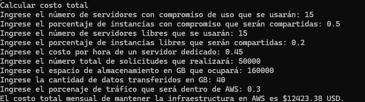

# IP - 2025-20
# N1-PROY: Calculadora de servicios en la nube

> [!warning]- Advertencia
> 
>**MUY IMPORTANTE:** Este proyecto debe desarrollarse de forma individual y el entregable debe ser 100% de su autoría. No está permitido utilizar ayudas no autorizadas (incluyendo chatbots o tecnologías similares), ni emplear temas o sintaxis que no hayan sido estudiados en el curso. El incumplimiento de lo anterior resultará en una calificación de cero (0.0) para todo el Nivel 1 y puede resultar en un proceso disciplinario.

## Objetivo general
El objetivo general de este proyecto es que usted practique los conceptos estudiados en el nivel 1 del curso. Recuerde que este proyecto debe realizarse de forma **completamente individual**.

## Objetivos específicos

1. Crear funciones.
2. Llamar funciones con parámetros.
3. Llamar funciones desde otras funciones (composición de funciones).
4. Crear y usar un módulo.
5. Probar las funciones de un módulo.
6. Construir interfaces de usuario basadas en consola.

En este proyecto se va a crear una aplicación que calcula los costos de algunos servicios prestados por la nube de AWS (Amazon Web Services), así como algunos tiempos de transferencia de archivos y conversiones entre unidades de tamaño de archivos.

## Contexto
#### Servicios Web
En el año 2006, Amazon lanzó un servicio llamado AWS (Amazon Web Services) con el objetivo de realizar la distribución de diversos servicios web. Para esto, AWS se aprovechó de una tecnología surgida más de 10 años atrás llamada “virtualización”, la cual permite correr simultáneamente varios sistemas independientes sobre los mismos recursos físicos.

Hoy en día, proveedores como Amazon, Microsoft, Oracle, y Google ofrecen servicios web sobre un modelo de Cloud Computing, que no son más que la posibilidad de tener máquinas virtuales corriendo sobre una infraestructura física controlada por el proveedor. Este modelo ha demostrado ser muy flexible y exitoso, esto gracias a que el modelo Cloud Computing es más flexible y hace posible pagar únicamente por los recursos utilizados, permitiendo aumentar o disminuir la capacidad de las máquinas virtuales de forma rápida y sencilla.

Para explicarlo en otras palabras, piense en cómo funciona el suministro de energía eléctrica en una ciudad, el cual es muy similar a Cloud Computing. Nosotros pagamos únicamente por la energía que consumimos y no es nuestra responsabilidad ni entender cómo funcionan los aparatos que la generan ni mucho menos mantenerlos funcionando. Además, si decidimos comprar un nuevo electrodoméstico y se empieza a consumir más energía, los costos aumentan proporcionalmente.

#### Amazon Web Services - AWS
Hoy en día, AWS ofrece a sus usuarios más de 175 servicios que se pueden combinar para soportar servicios web cada vez más complejos y poderosos. Sin embargo, dentro de la oferta de AWS hay dos servicios clave: servicios de procesamiento y servicios de almacenamiento y transferencia de datos. A continuación, estudiaremos cada uno. 

##### Servicios de procesamiento - Amazon Elastic Compute Cloud (EC2)
Este es el principal servicio de AWS, ofrece capacidad de cómputo con más de 400 tipos de máquinas virtuales que varían de acuerdo al número de procesadores (virtuales), la cantidad de memoria, el sistema operativo y la arquitectura del procesador. La mayoría de las máquinas virtuales que se pueden reservar comparten un servidor físico, lo cual las hace más económicas, aunque puede haber impactos negativos en su rendimiento. En ese caso se habla de instancias compartidas. Si no se quiere correr ese riesgo, AWS ofrece también servidores dedicados que son servidores físicos de uso exclusivo para un cliente, pero que tienen un costo mayor al de las instancias compartidas. **El cobro tanto de los servidores dedicados como de las instancias compartidas se realiza por horas de uso y las instancias compartidas tienen un 10% de descuento. Además, AWS ofrece descuentos si se realiza un compromiso de uso continuo por un plazo de 1 o más años.**

Por ejemplo, el uso de un servidor dedicado del tipo llamado *A1*, tiene un costo de 0.449 USD por hora. El uso de una instancia compartida con las mismas características de procesamiento y de memoria tiene un descuento del 10% (0.404 dólares por hora). 
Si además se hiciera un compromiso con un plazo de al menos 1 año, se tendrían que aplicar las siguientes fórmulas para calcular el costo por hora tanto de un servidor dedicado (SD) como de una instancia compartida (IC):
$$
\text{costo SD uso continuo}= (\text{costo de un SD} \cdot \text{\# de SD reservados})^\frac{9}{10}
$$
$$
\text{costo IC uso continuo}= (\text{costo de una IC} \cdot \text{\# de IC reservadas})^\frac{17}{20}
$$

##### Servicios de almacenamiento y transferencia - Amazon Simple Storage Service (S3)
Este es un servicio de almacenamiento que se puede usar para guardar datos de todo tipo como archivos subidos a sitios web, copias de seguridad, y registros de transacciones. En S3,  los datos se guardan en contenedores llamados _buckets_ y se ofrecen diferentes niveles de servicio de acuerdo con la cantidad de datos a almacenar y la frecuencia con que se consultarán los datos. 
El cobro del servicio S3 es mensual y se hace según la cantidad de información almacenada, el número de solicitudes realizadas sobre la información y la cantidad de datos que se hayan transferido. Se debe tener en cuenta que en AWS es “barato” mover archivos entre S3 y otros servicios de AWS, pero es mucho más costoso mover archivos desde y hacia Internet.

Los precios actuales para el nivel de servicio estándar son:

- **Almacenamiento:** 0.023 dólares por GB por mes.
- **Solicitudes de lectura:** 0.0004 dólares por cada 1000 solicitudes (se cobra fracción si son menos de 1000).
- **Solicitudes de escritura:** 0.005 dólares por cada 1000 solicitudes (se cobra fracción si son menos de 1000).
- **Transferencia hacia Internet:** 0.09 dólares por GB, siendo el primer GB gratis por mes.
- **Transferencia hacía otros servicios de AWS:** 0.02 dólares por GB.

##### Unidades de tamaño
El tamaño de un archivo almacenado o transferido se mide de acuerdo a la cantidad de bits que tenga. Los bits se agrupan en grupos de a 8 llamados bytes (B) y los bytes se agrupan en unidades cada vez más grandes para facilitar los cálculos y no tener que usar números muy grandes. De esta forma, 1024 bytes son 1 KB, 1024 KB son 1 MB, y 1024 MB son 1 GB. Fíjese que 1024 es exactamente 210, así que 1 MB es igual a $2^{20}$ bytes, y 1 GB es igual a $2^{30}$ bytes.  En general, en informática los prefijos kilo, mega, giga, tera, y peta hacen referencia a potencias de 1024.

##### Ancho de Banda
El ancho de banda que se contrata con un proveedor de servicios de Internet (ISP) hace referencia a la cantidad de información que se puede transferir por unidad de tiempo. En general, el ancho de banda que aparece en la publicidad de los proveedores puede estar expresada en MB por segundo o en Mbps (mega-bits por segundo). La diferencia es que los números en Mbps se ven más grandes porque hablan de bits y no de bytes. Por ejemplo, una imagen de 4 MB tardará 1 segundo en descargarse en una conexión de 4 MB por segundo y tardará 8 segundos en una conexión de 4 Mbps.

### Actividad 1: Preparación del ambiente de trabajo
1. Cree una carpeta de trabajo y renómbrela con su nombre o login.
2. Abra Spyder y cambie la carpeta de trabajo para que sea la carpeta que creó.

### Actividad 2: Construir el módulo de funciones para realizar los cálculos de AWS
3. Usando Spyder, cree en su carpeta de trabajo un nuevo archivo con el nombre ``calculadora_aws.py``. En este archivo usted va a construir un módulo en el que va a hacer varios cálculos sobre los indicadores que presentamos anteriormente. En cada caso le indicaremos qué valores entran como parámetro de las funciones y qué resultado deben arrojar.
4. Defina e implemente funciones en su nuevo archivo de acuerdo con la siguiente información.


==ATENCIÓN:== Para asegurar que no haya problemas durante el proceso de calificación, usted debe definir las funciones con los nombres, parámetros y tipos exactos que se presentan a continuación. Las funciones deben estar definidas en el mismo orden. **NOTA:** **Asuma meses de 30 días y en las respuestas redondee todos los números de punto flotante a dos decimales.**

---

*Nombre de la función*: `tiempo_transferencia`.

*Descripción de la función*: Realiza el cálculo del tiempo que tardaría la transferencia de varios archivos de unos servidores locales a AWS según su tamaño en GB y el ancho de banda medido en Mbps.

**Parámetros**

| Nombre      | Tipo    | Descripción                                                                       |
| ----------- | ------- | --------------------------------------------------------------------------------- |
| tamano      | `float` | Tamaño total en GB de los archivos a transferir                                   |
| ancho_banda | `int`   | Ancho de banda en Mbps contratados.                                               |
| **Retorno** | `float` | Tiempo total de transferencia del archivo en minutos, redondeado a dos decimales. |

---

*Nombre de la función*: `costo_procesamiento_compromiso`.

*Descripción de la función*: Calcula el costo mensual de mantener un número determinado de servidores dedicados y un número determinado de instancias compartidas, teniendo en cuenta el costo por hora que se cobra por un servidor dedicado. Se asume un compromiso de por lo menos 1 año.

**Parámetros**

| Nombre                 | Tipo    | Descripción                                                                                                 |
| ---------------------- | ------- | ----------------------------------------------------------------------------------------------------------- |
| servidores_dedicados   | `int`   | Número de servidores dedicados con compromiso que se utilizarán.                                            |
| instancias_compartidas | `int`   | Número de instancias compartidas con compromiso que se utilizarán.                                          |
| costo_total            | `float` | Costo en USD de un servidor dedicado reservado por una hora.                                                |
| **Retorno**            | `float` | Costo total que se tendrá que pagar por el mes de procesamiento con compromiso, redondeado a dos decimales. |

---

*Nombre de la función*: `costo_procesamiento_libre`.

*Descripción de la función*: Calcula el costo mensual de mantener un número determinado de servidores dedicados y un número determinado de instancias compartidas, sin compromiso de permanencia, teniendo en cuenta el costo por hora que se cobra por un servidor dedicado.

**Parámetros**

| Nombre                 | Tipo    | Descripción                                                                                                 |
| ---------------------- | ------- | ----------------------------------------------------------------------------------------------------------- |
| servidores_dedicados   | `int`   | Número de servidores dedicados libres que se utilizarán.                                                    |
| instancias_compartidas | `int`   | Número de instancias compartidas libres que se utilizarán.                                                  |
| costo_total            | `float` | Costo en USD de un servidor dedicado reservado por una hora.                                                |
| **Retorno**            | `float` | Costo total que se tendrá que pagar por el mes de procesamiento con compromiso, redondeado a dos decimales. |

---

*Nombre de la función*: `costo_almacenamiento`.

*Descripción de la función*: Calcula el costo total mensual por almacenamiento en un bucket S3 estándar según el número de solicitudes de lectura, solicitudes de escritura y tamaño de los datos almacenados en GB.

**Parámetros**

| Nombre         | Tipo    | Descripción                                                                                                     |
| -------------- | ------- | --------------------------------------------------------------------------------------------------------------- |
| lectura        | ``int`` | Número de solicitudes de lectura.                                                                               |
| escritura      | ``int`` | Número de solicitudes de escritura.                                                                             |
| almacenamiento | `float` | Tamaño de los datos almacenados en GB.                                                                          |
| **Retorno**    | `float` | Costo total que se tendrá que pagar por el almacenamiento en el bucket S3 estándar, redondeado a dos decimales. |

---

*Nombre de la función*: `costo_transferencia`.

*Descripción de la función*: Calcula el costo mensual de transferencia de datos, teniendo en cuenta la cantidad de datos enviados desde las instancias hacia Internet y hacia instancias de AWS en otra región.

**Parámetros**

| Nombre         | Tipo      | Descripción                                                             |
| -------------- | --------- | ----------------------------------------------------------------------- |
| datos          | ``float`` | Cantidad de datos en GB.                                                |
| porcentaje_aws | ``float`` | Porcentaje de datos que se transfieren dentro de AWS (número de 0 a 1). |
| **Retorno**    | `float`   | Costo total de la transferencia de datos, redondeado a dos decimales.   |

---

*Nombre de la función*: `costo_total`

*Descripción de la función*: Calcula el costo mensual de contratar una infraestructura que incluye procesamiento, almacenamiento y transferencia de datos. Para las solicitudes de transferencia se asume que $\frac{1}{3}$ corresponden a escritura.

**Parámetros**

| Nombre                            | Tipo      | Descripción                                                                                                        |
| --------------------------------- | --------- | ------------------------------------------------------------------------------------------------------------------ |
| servidores_compromiso             | `int`     | Número total de máquinas virtuales (servidores dedicados e instancias compartidas), con compromiso de permanencia. |
| porcentaje_compartidas_compromiso | ``float`` | Porcentaje de instancias que serán compartidas, con compromiso de permanencia.                                     |
| servidores_libres                 | ``int``   | Número total de máquinas virtuales (servidores dedicados e instancias compartidas) libres.                         |
| porcentaje_compartidas_libres     | ``float`` | Porcentaje de instancias que serán compartidas, libres.                                                            |
| costo_dedicado                    | ``float`` | Costo por hora de un servidor dedicado.                                                                            |
| solicitudes_totales               | ``int``   | Número de solicitudes totales de lectura y escritura.                                                              |
| almacenamiento                    | ``float`` | Espacio de almacenamiento en GB.                                                                                   |
| datos_transferidos                | ``int``   | Cantidad de datos transferidos en GB.                                                                              |
| trafico_aws                       | ``float`` | Porcentaje de tráfico que se queda dentro de otros servicios de AWS.                                               |
| **Retorno**                       | ``float`` | Costo total mensual en USD de mantener la infraestructura en AWS, redondeado a dos decimales.                      |

### Actividad 3: Construir interfaces de usuario basadas en consola

En esta actividad usted tiene que construir las interfaces basadas en consola para que el usuario interactúe con la aplicación.

**ATENCIÓN**: las interfaces basadas en consola deben seguir el estándar de construcción de consolas visto en clase.

5. Construya un nuevo archivo Python para cada uno de los 6 problemas que se resuelven con la aplicación. Los nombres deben ser:
	- `consola_costo_procesamiento_compromiso.py`
	- ``consola_costo_procesamiento_libre.py``
	- ``consola_costo_almacenamiento.py``
	- ``consola_costo_transferencia.py``
	- ``consola_tiempo_transferencia.py``
	- ``consola_costo_total.py``

**Estos archivos deben ser creados dentro de la misma carpeta donde se encuentra su módulo de cálculos de AWS.**

6. Los nuevos archivos deben importar su módulo de cálculos de AWS para que puedan usar las funciones que definió en el módulo. Por ejemplo, podría usar la siguiente línea para importar el módulo:

```python
import calculadora_aws as calc
```

7. Implemente cada uno de los seis programas de interfaz por consola. Cada uno de estos debe pedirle al usuario los datos necesarios para resolver el problema y debe informarle de su resultado. A modo de ejemplo, la siguiente imagen muestra lo que podría ser el resultado del ejecutar el programa “``consola_costo_total.py``”.



8. Ejecute cada uno de los 6 programas para asegurarse que estén funcionando.

### Actividad 4: Verificar el módulo de cálculos AWS

9. Ejecute cada uno de los 5 programas utilizando los datos que se presentan a continuación y asegúrese que los resultados sean consistentes con lo que se presenta como resultado esperado en la tabla.

| **Programa**                              | **Entradas**                                                                                                                                                                                                                                                                                  | **Salidas**                                                                                         |
| ----------------------------------------- | --------------------------------------------------------------------------------------------------------------------------------------------------------------------------------------------------------------------------------------------------------------------------------------------- | --------------------------------------------------------------------------------------------------- |
| consola_tiempo_transferencia.py           | tamano: 50<br><br>ancho_banda: 10                                                                                                                                                                                                                                                             | El tiempo de transferencia de los archivos es 682.67 minutos.                                       |
| consola_tiempo_transferencia.py           | tamano: 140<br><br>ancho_banda: 75                                                                                                                                                                                                                                                            | El tiempo de transferencia de los archivos es 254.86 minutos.                                       |
| consola_costo_procesamiento_compromiso.py | servidores_dedicados: 15<br><br>instancias_compartidas: 15<br><br>costo: 0.45                                                                                                                                                                                                                 | El costo de aprovisionar esa capacidad de procesamiento con compromiso por un mes es $7352.12 USD.  |
| consola_costo_procesamiento_compromiso.py | servidores_dedicados: 30<br><br>instancias_compartidas: 15<br><br>costo: 0.45                                                                                                                                                                                                                 | El costo de aprovisionar esa capacidad de procesamiento con compromiso por un mes es $10829.53 USD. |
| consola_costo_procesamiento_libre.py      | servidores_dedicados: 15<br><br>instancias_compartidas: 15<br><br>costo: 0.45                                                                                                                                                                                                                 | El costo de aprovisionar esa capacidad de procesamiento libre es $9234.0 USD.                       |
| consola_costo_procesamiento_libre.py      | servidores_dedicados:30<br><br>instancias_compartidas: 15<br><br>costo: 0.45                                                                                                                                                                                                                  | El costo de aprovisionar esa capacidad de procesamiento libre es $14094.0 USD.                      |
| consola_costo_almacenamiento.py           | lectura: 15300<br><br>escritura: 8900<br><br>almacenamiento: 100000                                                                                                                                                                                                                           | El costo de almacenamiento por un mes es $2300.05 USD.                                              |
| consola_costo_almacenamiento.py           | lectura: 148500<br><br>escritura: 90240<br><br>almacenamiento: 248000                                                                                                                                                                                                                         | El costo de almacenamiento por un mes es $5704.51 USD.                                              |
| consola_costo_transferencia.py            | salida: 40960<br><br>trafico_aws: 0.3                                                                                                                                                                                                                                                         | El costo de trasnferencia de la información es $2807.52 USD.                                        |
| consola_costo_transferencia.py            | salida: 609760<br><br>trafico_aws: 0.43                                                                                                                                                                                                                                                       | El costo de trasnferencia de la información es $36524.53 USD.                                       |
| consola_costo_total.py                    | servidores_compromiso: 15<br><br>porcentaje_compartidas_compromiso: 0.5<br><br>servidores_libres: 15<br><br>porcentaje_compartidas_libres: 0.2<br><br>costo_dedicado: 0.45<br><br>solicitudes_totales: 50000<br><br>almacenamiento: 160000<br><br>trafico_salida: 40<br><br>trafico_aws: 0.3  | El costo total mensual de mantener la infraestructura en AWS es $12423.38 USD.                      |
| consola_costo_total.py                    | servidores_compromiso: 10<br><br>porcentaje_compartidas_compromiso: 0.5<br><br>servidores_libres: 10<br><br>porcentaje_compartidas_libres: 0.3<br><br>costo_dedicado: 0.59<br><br>solicitudes_totales: 100000<br><br>almacenamiento: 300000<br><br>trafico_salida: 80<br><br>trafico_aws: 0.2 | El costo total mensual de mantener la infraestructura en AWS es $14584.11 USD.                      |

10. Si alguno de sus programas presenta algún error o si el resultado es significativamente diferente al esperado, revise y corrija su módulo de cálculos AWS. Es posible que le aparezcan errores causados por errores de tecleo en el nombramiento de las funciones, errores causados por declarar los parámetros en el orden equivocado. Cada vez que corrija algo, vuelva a realizar las pruebas.

**Nota**: Las pruebas que está realizando son un mecanismo para identificar posibles problemas con un programa, pero no pueden ser consideradas una garantía de su correcto funcionamiento. Entre más completas estén las pruebas, por ejemplo, verificando casos normales, extremos y anormales, más tranquilidad tendremos de que el programa está bien construido.

## Entrega

11. Comprima la carpeta con su proyecto resuelto. El archivo debería llamarse **N1-PROY-login.zip**, donde login es su nombre de usuario de Uniandes.
12. Entregue el archivo comprimido a través de Brightspace en la actividad del nivel 1 designada como **Proyecto del Nivel 1**.

> [!warning]- Advertencia
> 
>**MUY IMPORTANTE:** Este proyecto debe desarrollarse de forma individual y el entregable debe ser 100% de su autoría. No está permitido utilizar ayudas no autorizadas (incluyendo chatbots o tecnologías similares), ni emplear temas o sintaxis que no hayan sido estudiados en el curso. El incumplimiento de lo anterior resultará en una calificación de cero (0.0) para todo el Nivel 1 y puede resultar en un proceso disciplinario.
